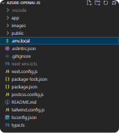
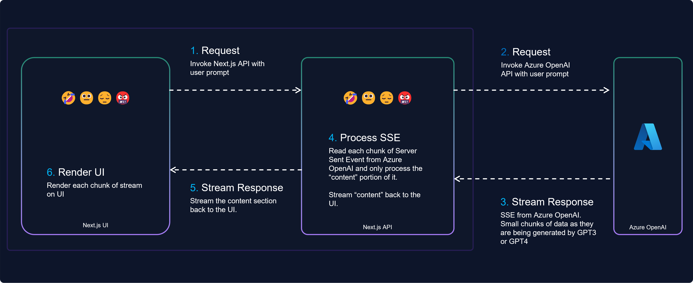

## Setup Instructions

First, generate a .env.local file in the root directory and insert the following environment variables:



```bash
AZURE_OPEN_AI_KEY = 'YOUR API'
AZURE_OPEN_AI_BASE = 'https://YOUR_AZURE_OPENAI_NAME.openai.azure.com/openai/deployments/YOUR_AZURE_OPENAI_DEPLOYMENT_NAME'
AZURE_OPEN_AI_CHAT_VERSION = '2023-03-15-preview'
```

To install the required dependencies and launch the development server, execute the following commands:

```bash
npm install
npm run dev
```

Open [http://localhost:3000](http://localhost:3000) with your browser to see the result.

# Introduction

[](https://youtu.be/Rb5wVIAlEcQ)
The Azure OpenAI API offers the capability of streaming responses, enabling access to information as it becomes available, rather than waiting for a complete response.

This functionality significantly improves user experiences by allowing real-time display of AI-generated content and processing the responses as they become available. As a result, applications built using the OpenAI API become more dynamic and engaging in user interactions.

A notable example of this approach can be seen in the ChatGPT and [Bing Chat](https://www.bing.com/search?q=Bing+AI&showconv=1&FORM=hpcodx) user interfaces. When a question is asked, the responses are displayed as they are generated, instead of waiting for the entire response to be completed.

# Streaming with Azure OpenAI

Before we delve into the code let's look at the steps required to consume Azure OpenAI via streaming.



1. **Request**: To initiate the process, the UI sends the user prompt to the Next.js API. This API call triggers the subsequent interaction between the application and Azure OpenAI, allowing the user to obtain real-time responses from the AI model.
    
2. **Request**: The Next.js API then invokes the Azure OpenAI API with the user's prompt. This step connects the application to Azure OpenAI, enabling it to access GPT-3 or GPT-4 models for generating relevant responses.
    
3. **Stream Response**: Azure OpenAI sends back responses in the form of Server Sent Events (SSE). The SSE format allows small chunks of data to be transmitted as they are generated by GPT-3 or GPT-4, ensuring a continuous flow of information without waiting for the entire response.
    
    ### Server-sent events (SSE)
    
    With the OpenAI streaming API call, the response is sent back incrementally in chunks via an [event stream](https://developer.mozilla.org/en-US/docs/Web/API/Server-sent_events/Using_server-sent_events). These streams are essentially Server-sent events (SSE).
    
    Server-sent events (SSE) are a way of sending data from a server to a client in a one-way stream. Unlike WebSocket, SSE does not require a persistent connection and can work over HTTP. SSE are useful for scenarios where the server needs to push updates to the client, such as real-time data streaming, notifications, or progress reports.
    
    These chunks, each beginning with `data` contain information, such as an ID, content, creation time, and model. As shown in the example below, you can see how each chunk represents a piece of the answer that, when put together, forms a complete response. To indicate the end of the stream, a final chunk with "\[DONE\]" is sent allowing the UI to prompt for the next action.
    
    ```
    //chuck one
    data: {"id":"chatcmpl-7C1xK1ZAXweiPnsL35Alr7DVQz0xH","object":"chat.completion.chunk","created":1683101810,"model":"gpt-35-turbo","choices":[{"index":0,"finish_reason":null,"delta":{"content":" you"}}],"usage":null}
    
    // chunk two
    data: {"id":"chatcmpl-7C1xK1ZAXweiPnsL35Alr7DVQz0xH","object":"chat.completion.chunk","created":1683101810,"model":"gpt-35-turbo","choices":[{"index":0,"finish_reason":null,"delta":{"content":" instead"}}],"usage":null}
    
    // last chunk with [DONE] to indicate that the stream is complete
    data: [DONE]
    ```
    
4. **Process Server Sent Events (SSE)**: As each chunk of SSE data is received from Azure OpenAI, the Next.js API reads and processes the "content" portion of the data. By focusing only on the "content" part, the application extracts the essential information needed to provide relevant responses to the user.
    
5. **Stream Response**: After processing the "content" section of each SSE data chunk, the application streams this content back to the UI. This step ensures that users receive real-time feedback as the AI model generates responses, providing an interactive experience.
    
6. **Render UI**: Finally, the application renders each chunk of streamed content on the UI. This step allows users to see the AI-generated responses in real-time, enabling them to interact with the model and receive feedback as the conversation progresses.
    

The final solution and the code walkthrough is on GitHub [https://github.com/thivy/azure-openai-js-stream](https://github.com/thivy/azure-openai-js-stream)

# Code Walkthrough

Let's now look into each part of the flow diagram and build the API and UI together using Next.js.

The final solution is on GitHub [https://github.com/thivy/azure-openai-js-stream](https://github.com/thivy/azure-openai-js-stream)

## Process SSE

Step 4 on the flow diagram

The code below defines a class called `SSEParser` handles SSE by parsing incoming data chunks and providing callback functions to track the progress. The `SSEEvents` type includes three callback functions: `onError`, `onData`, and `onComplete`.

1. `onError`: This callback function is called when an error occurs during the processing of an event. It takes an `error` object as its input and allows handling the error accordingly.
    
2. `onData`: This function is called whenever a new chunk of data is processed, extracting the `content` from the data. It takes a `data` string as its input, which is the extracted content.
    
3. `onComplete`: This function is called when the stream has reached its end, indicated by the "\[DONE\]" marker in the incoming data.
    

```javascript
export type SSEEvents = {
  onError: (error: unknown) => void;
  onData: (data: string) => void;
  onComplete: () => void;
};

export class SSEParser {
  private onError: (error: unknown) => void;
  private onData: (data: string) => void;
  private onComplete: () => void;

  constructor(ssEvents: SSEEvents) {
    this.onError = ssEvents.onError;
    this.onComplete = ssEvents.onComplete;
    this.onData = ssEvents.onData;
  }

// Takes an input string and processes it line by line, accumulating the data until a new line or the end of the stream is reached. 
  public parseSSE(input: string) {
    let accumulatedData = input;
    let pos = 0;
    let data = "";
    while (pos < accumulatedData.length) {
      const lineEnd = accumulatedData.indexOf("\n", pos);
      if (lineEnd === -1) {
        break;
      }

      const line = accumulatedData.slice(pos, lineEnd).trim();
      pos = lineEnd + 1;

      if (line.startsWith("data:")) {
        const eventData = line.slice(5).trim();

        if (eventData === "[DONE]") {
          this.onComplete();
          break;
        } else {
          data += eventData;
        }
      } else if (line === "") {
        if (data) {
          this.processEvent(data);
          data = "";
        }
      }
    }
  }
//parse the data as JSON and extract the content from the JSON object. If successful, the onData callback function is called with the extracted content
  private processEvent(data: string): string {
    try {
      const json = JSON.parse(data);
      const text = json.choices[0].delta?.content || "";
      this.onData(text);
      return text;
    } catch (e) {
      this.onError(e);
      return "";
    }
  }
}
```

## Azure OpenAI API Helper

Steps 2 & 3 on the flow diagram

The code below defines a class called `AzureOpenAI` that interacts with the Azure OpenAI API to create chat completions.

```javascript
import {
  AzureOpenAIConfiguration,
  CreateChatCompletionRequest,
} from "./models";
import { SSEParser } from "./sse-parser";

export class AzureOpenAI {
  private configuration: AzureOpenAIConfiguration;

  constructor(configuration: AzureOpenAIConfiguration) {
    this.configuration = configuration;
  }

// This method sends a POST request to the Azure OpenAI API to create chat completions, It then processes the response using createStreamFromResponse method.
  public async createChatCompletion(
    createChatCompletionRequest: CreateChatCompletionRequest
  ) {
    const chatAPI = `${this.configuration.basePath}/chat/completions?api-version=${this.configuration.chatVersion}`;
    const jsonString = this.stringifyJsonWithoutNulls(
      createChatCompletionRequest
    );

    const response = await fetch(chatAPI, {
      headers: {
        "Content-Type": "application/json",
        "api-key": this.configuration.apiKey,
      },
      method: "POST",
      body: jsonString,
    });

    const stream = this.createStreamFromResponse(response);
    return stream;
  }

// This method creates a readable stream from the fetched response so that we can stream the content back to the UI
  private createStreamFromResponse(response: Response) {
    const source: UnderlyingDefaultSource<Uint8Array> = {
      start: async (controller) => {
        if (response && response.body && response.ok) {
          const reader = response.body.getReader();
          try {
            await this.processResponse(reader, controller);
          } catch (e) {
            controller.error(e);
          } finally {
            controller.close();
            reader.releaseLock();
          }
        } else {
          if (!response.ok) {
            controller.error(response.statusText);
          } else {
            controller.error("No response body");
          }
        }
      },
    };

    return new ReadableStream(source);
  }

// process each chunk of data that is returned back from Azure OpenAI
  private async processResponse(
    reader: ReadableStreamDefaultReader<Uint8Array>,
    controller: ReadableStreamDefaultController<Uint8Array>
  ) {
    const SSEEvents = {
      onError: (error: any) => {
        controller.error(error);
      },
      onData: (data: string) => {
        const queue = new TextEncoder().encode(data);
        controller.enqueue(queue);
      },
      onComplete: () => {
        controller.close();
      },
    };

    const decoder = new TextDecoder();
    const sseParser = new SSEParser(SSEEvents);

    while (true) {
      const { value, done } = await reader.read();
      if (done) break;

      const chunkValue = decoder.decode(value);
      sseParser.parseSSE(chunkValue);
    }
  }


//This utility method converts a JavaScript object to a JSON string, excluding null or undefined values. 
  private stringifyJsonWithoutNulls(obj: any): string {
    return JSON.stringify(obj, (key, value) => {
      if (value === null || value === undefined) {
        return undefined;
      }
      return value;
    });
  }
}
```

## Next.js API

Step 5 on the flow diagram

Inside the main API entry point `api/azure-openai/route.ts` we can simply stream the response back to the UI with `ReadableStream`

```javascript
import { AzureOpenAI } from "./azure-openai";
import { AzureOpenAIConfiguration } from "./models";

/**
 * Main entry point for the API.
 **/

export async function POST(request: Request) {
  // read the request body as JSON
  const payload = (await request.json()) as IChatGPTPayload;

  const config: AzureOpenAIConfiguration = {
    basePath: process.env.AZURE_OPEN_AI_BASE,
    apiKey: process.env.AZURE_OPEN_AI_KEY,
    chatVersion: process.env.AZURE_OPEN_AI_CHAT_VERSION,
  };

  const azure = new AzureOpenAI(config);

  const stream = await azure.createChatCompletion({
    messages: [
      {
        role: "system",
        content: mapStyle(payload.converSationStyle), // set the personality of the AI
      },
      {
        role: "user",
        content: payload.prompt, // set the prompt to the user's input
      },
    ],
    stream: true, // stream the response
  });
  return new Response(stream);
}
```

## Next.js UI

Step 1 on the flow diagram

We can now invoke our Azure OpenAI API using the Next.js API to render the streamed chunks of content.

```javascript

  const promptChatGPT = async (payload: IChatGPTPayload) => {
    setIsLoading(true);
    setResponse("let me think...");

// start the request with the payload
    const response: Response = await fetch("/api/azure-openai", {
      method: "POST",
      body: JSON.stringify(payload),
      headers: {
        "Content-Type": "application/json",
      },
    });

// start reading the stream data
    const reader = response.body!.getReader();
    const decoder = new TextDecoder();

    let completeResponse = "";

// iterate through the streamed data until it's done
    while (true) {
      const { value, done: doneReading } = await reader.read();
      if (doneReading) break;

      const chunkValue = decoder.decode(value);
      completeResponse += chunkValue;

      setResponse(completeResponse);
    }

// setui to complete
    setIsLoading(false);
  };
```
