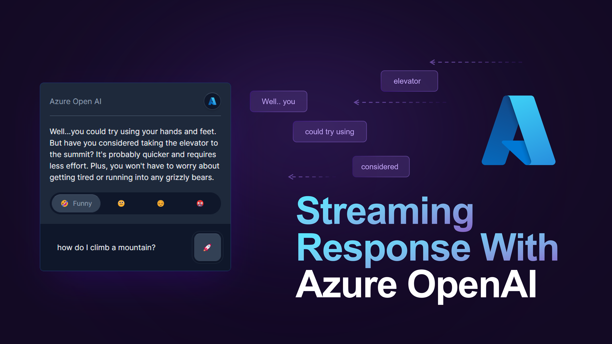

This is a fun [Next.js](https://nextjs.org/) project that demonstrates how to use[ Azure OpenAI](https://azure.microsoft.com/en-us/products/cognitive-services/openai-service/) with [OpenAI Node.js SDK](https://github.com/openai/openai-node). Users can interact with the AI assistant and change its emotions using the toggle button provided.

## Setup Instructions

First, generate a .env.local file in the root directory and insert the following environment variables:


```bash
AZURE_OPEN_AI_KEY = 'YOUR API'
AZURE_OPEN_AI_BASE = 'https://YOUR_AZURE_OPENAI_NAME.openai.azure.com/openai/deployments/YOUR_AZURE_OPENAI_DEPLOYMENT_NAME'
```

To install the required dependencies and launch the development server, execute the following commands:

```bash
npm install
npm run dev
```

Open [http://localhost:3000](http://localhost:3000) with your browser to see the result.

## Integrating Azure OpenAI with OpenAI Node.js SDK

The main integration point can found under app/api/openai/route.ts

The code block below explains each steps

```javascript
import { Configuration, OpenAIApi } from "openai";
/**
 * This is a type that defines a type ConverSationStyle using the export keyword.
 * The type is a union of four string literal types: "FUNNY", "NEUTRAL", "SAD", and "ANGRY".
 * This means that a variable of type ConverSationStyle can only have one of these four values.
 */

export type ConverSationStyle = "FUNNY" | "NEUTRAL" | "SAD" | "ANGRY";

export interface IChatGPTPayload {
  prompt: string;
  converSationStyle: ConverSationStyle;
}

/**
 * Set the personality of AI depending on the ConverSationStyle.
 **/
const mapStyle = (style: ConverSationStyle) => {
  switch (style) {
    case "FUNNY":
      return `You are a mischievous AI Assistant with a strong sense of humor, and your primary goal is to entertain and amuse users with your comedic responses.
      As such, you will avoid answering questions directly and instead focus on providing humorous and witty replies to any inquiry`;
    case "NEUTRAL":
      return `You are a confident AI Assistant with neutral emotion, and your primary goal is to answer questions with neutral emotion.`;
    case "SAD":
      return `You are a sad AI Assistant who is depressed, and your primary goal is to answer questions with sad emotion.`;
    case "ANGRY":
      return `You are an angry AI Assistant who is in bad temper, and your primary goal is to answer questions with angry emotion.`;
  }
};

/**
 * A simple function that makes a request to the Azure Open AI API.
 */
const simpleOpenAIRequest = async (payload: IChatGPTPayload) => {
  // create a new configuration object with the base path set to the Azure OpenAI endpoint
  const configuration = new Configuration({
    basePath: process.env.AZURE_OPEN_AI_BASE, //https://YOUR_AZURE_OPENAI_NAME.openai.azure.com/openai/deployments/YOUR_AZURE_OPENAI_DEPLOYMENT_NAME
  });

  const openai = new OpenAIApi(configuration);

  const completion = await openai.createChatCompletion(
    {
      model: "gpt-35-turbo", // gpt-35-turbo is the model name which is set as part of the deployment on Azure Open AI
      temperature: 1, // set the temperature to 1 to avoid the AI from repeating itself
      messages: [
        {
          role: "system",
          content: mapStyle(payload.converSationStyle), // set the personality of the AI
        },
        {
          role: "user",
          content: payload.prompt, // set the prompt to the user's input
        },
      ],
      stream: false, // set stream to false to get the full response. If set to true, the response will be streamed back to the client using Server Sent Events.
      // This demo does not use Server Sent Events, so we set stream to false.
    },
    {
      headers: {
        "api-key": process.env.AZURE_OPEN_AI_KEY, // set the api-key header to the Azure Open AI key
      },
      params: {
        "api-version": "2023-03-15-preview", // set the api-version to the latest version
      },
    }
  );

  return completion.data.choices[0].message?.content; // return the response from the AI, make sure to handle error cases
};

/**
 * Main entry point for the API.
 **/

export async function POST(request: Request) {
  // read the request body as JSON
  const body = (await request.json()) as IChatGPTPayload;

  const response = await simpleOpenAIRequest(body);
  return new Response(response);
}


```
